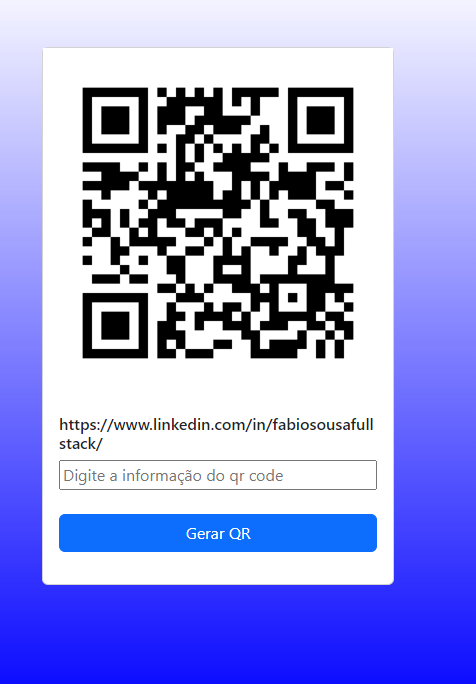

# Gerador de Qr Code

## Modo de uso.
O executável pode ser encontrado em: 

https://drive.google.com/file/d/1gwn8K24HWsao-W3ci5H12EiythnbG24Z/view?usp=share_link

Ou

`git clone https://github.com/FabioSousaFullStack/gerador-de-qr-code.git`

E rode com o comando: go run main.go

## Aprendizados

### Consumo de API

- Utilização da API para geração do qr code.

### Criação de executáveis

- Utilização do build na montagem do exe do 
Go.

### Como subir um servidor em Go

- Utilização do net/http;

### Utilização dos seguintes pacotes
    flag
    html/template
    log
    net/http
    fmt

